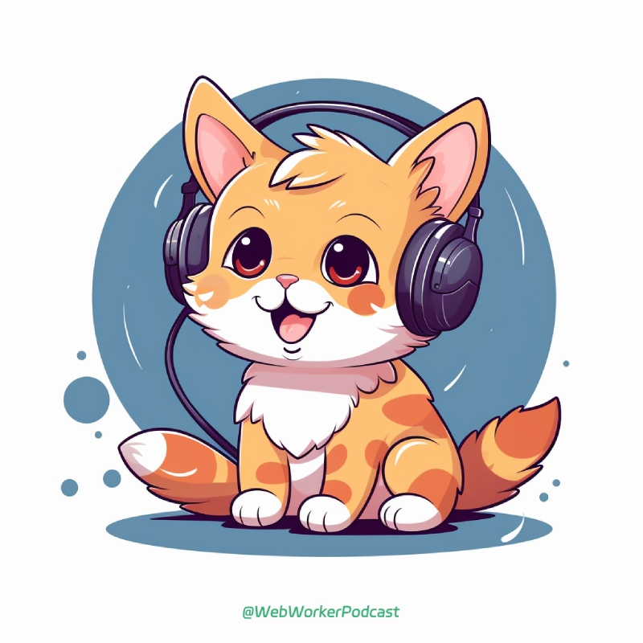

# Web Worker Podcast Admin



## 项目简介

本项目是 Web Worker Podcast 的管理页面，方便主播统一管理播客相关信息，统一管理，方便分发和维护。

计划提供下面功能：

- 播客 CMS 内容管理，文字、音频存储
- 播客分发小助手。因为国内更鼓励不同平台单独维护，这里提供响应辅助工具，快速完成上传和节目填充内容。
- 播客在线录音间。实现远程录制播客，不用额外的工具。
- 播客简单剪辑。提供播客常见的处理工具实现剪辑，方便轻度使用的人快速上线。

## 功能特性

- 统一管理。一套程序管理所有播客相关信息。
- 面向大众。希望可以服务更多播客主播，快速上传内容。
- 数据趋势汇总。不同平台的数据收集整理，方便快速查阅不同分发渠道的数据情况。

## 技术栈

列出项目所使用的主要技术栈：

- Nuxt 实现主程序
- Arco Design + Tailwind CSS 负责相关样式
- Laf.run 实现后端数据库、后端函数逻辑

## 安装指南

提供项目的安装指南，包括依赖项的安装和配置。

```bash
pnpm i
```

## 使用说明

提供项目的使用说明，包括如何运行、如何配置和如何使用。

### 本地开发环境

```bash
npm run dev
```

### 构建生产产物

```bash
npm run build
npm run preview
```

## 贡献指南

项目和代码还在不断完善，你可以提出问题，鼓励 Fork 并提 PR。发展初期不欢迎憋大招的超大 PR 哈。

## 版权信息、许可证

MIT License.

## 作者信息

- 辛宝 Otto

## 常见问题

暂无。

## 更新日志

暂无。

## 相关链接

提供与项目相关的其他链接，如文档、示例和演示。

## 致谢

在这个项目中，每一个贡献者都是不可或缺的。你们的代码、文档、问题反馈和建议都对项目的完善起到了重要作用。你们的热情和才华使得这个项目变得更加出色和有价值。

我们要特别感谢那些积极参与讨论、提交问题和解决方案的人员。你们的思维和见解为项目带来了新的灵感和创意。你们的贡献不仅仅是代码，更是对项目的持续改进和发展的推动力。

再次向所有为项目做出贡献的人员和组织表示衷心的感谢！你们的付出和努力使得这个项目成为可能，我们将继续努力，为你们带来更好的项目体验和价值。
